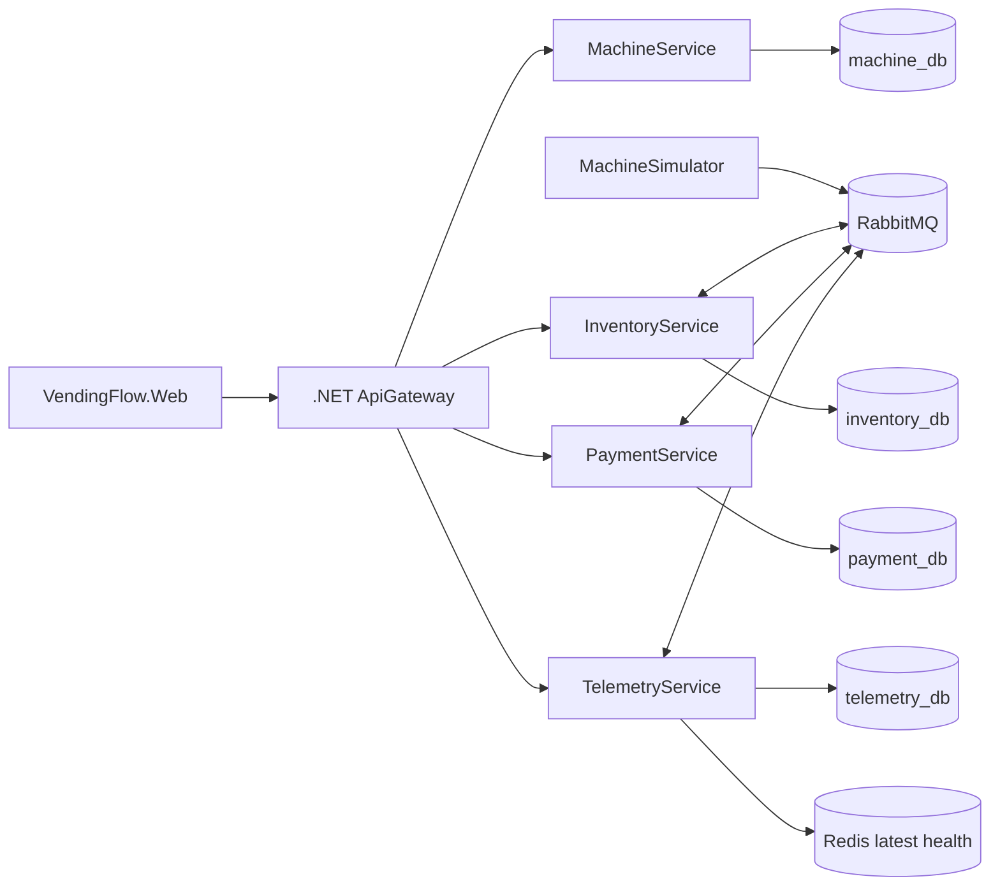

# VendingFlow

VendingFlow is a scaled-down local proof of concept for a distributed vending-machine management platform. It demonstrates machine metadata, stock control, simulated payment processing, dispensing, telemetry, RabbitMQ event flow, Redis latest-state caching, and a Next.js operations dashboard.



## Services

- `VendingFlow.MachineService`: .NET 8 Clean Architecture/CQRS service for vending machine registration, metadata, and status.
- `VendingFlow.InventoryService`: .NET 8 Clean Architecture/CQRS service for products, inventory, stock movements, and vending transaction orchestration.
- `VendingFlow.PaymentService`: .NET 8 Clean Architecture/CQRS service for financial transactions only. Vending transactions and payment transactions are separate models.
- `VendingFlow.MachineSimulator`: .NET 8 worker that simulates four physical machines, heartbeats, dispensing success, and dispensing failure.
- `VendingFlow.TelemetryService`: Java 17 Spring Boot service that persists heartbeat history in PostgreSQL and caches latest health in Redis.
- `VendingFlow.ApiGateway`: .NET 8 local gateway routing `/api/machines`, `/api/inventory`, `/api/payments`, and `/api/telemetry`.
- `VendingFlow.Web`: Next.js fleet dashboard.

## Local URLs

- Gateway: `http://localhost:5000`
- Machine Service Swagger: `http://localhost:5001/swagger`
- Inventory Service Swagger: `http://localhost:5002/swagger`
- Payment Service Swagger: `http://localhost:5003/swagger`
- Telemetry Service: `http://localhost:8084/api/telemetry/machines`
- RabbitMQ Management: `http://localhost:15672` (`vendingflow` / `vendingflow`)
- Next.js Dashboard: `http://localhost:5173`

## Run

Start PostgreSQL, RabbitMQ, and Redis locally before running the services.

Run services in separate terminals:

```bash
dotnet run --project VendingFlow.MachineService/src/Services/MachineService.API --urls http://localhost:5001
dotnet run --project VendingFlow.InventoryService/src/Services/InventoryService.API --urls http://localhost:5002
dotnet run --project VendingFlow.PaymentService/src/Services/PaymentService.API --urls http://localhost:5003
dotnet run --project VendingFlow.ApiGateway --urls http://localhost:5000
dotnet run --project VendingFlow.MachineSimulator
cd VendingFlow.TelemetryService && mvn spring-boot:run
cd VendingFlow.Web && npm install && npm run dev
```

Machine and Inventory services use the same generic command endpoint style as the local approval workflow service.

```json
{ "service": "getMachines", "data": {} }
```

```json
{ "service": "registerMachine", "data": { "machineCode": "VM-005", "name": "Demo Machine", "location": "Nairobi" } }
```

```json
{ "service": "reserveProduct", "data": { "machineId": "VM-001", "productId": "PRODUCT_GUID" } }
```

Telemetry uses Flyway migration `V1__telemetry.sql`.

## Demo Scenarios

1. Successful purchase: open the dashboard and click `Buy Mango` for `VM-001`. Inventory publishes `payment.requested`, Payment publishes `payment.confirmed`, Inventory publishes `product.dispense.requested`, Simulator publishes `product.dispensed`, and Inventory decrements stock from 20 to 19 and completes the transaction.
2. Low inventory: click `Buy Mango` on `VM-002` until stock reaches the low threshold. Inventory publishes `inventory.low`.
3. Dispensing failure: click `Buy Mango` on `VM-003`. The simulator emits `product.dispense.failed`, inventory remains unchanged, Inventory requests a refund, Payment emits `payment.refunded`, and the vending transaction becomes `REFUNDED`. In the simulator console, `fail-vm003 off` disables the failure and `fail-vm003 on` re-enables it.
4. Machine offline: in the simulator console enter `stop-vm004`. Telemetry transitions VM-004 from `ONLINE` to `DEGRADED` after 30 seconds and `OFFLINE` after 60 seconds. Enter `resume-vm004` to return it to `ONLINE`.

## Event Architecture

Events use a standard envelope:

```json
{
  "eventId": "uuid",
  "eventType": "payment.confirmed",
  "timestamp": "2026-09-29T12:00:00Z",
  "correlationId": "same-for-whole-purchase",
  "machineId": "VM-001",
  "payload": {}
}
```

Implemented routing keys include `machine.heartbeat`, `payment.requested`, `payment.confirmed`, `payment.refund.requested`, `payment.refunded`, `product.dispense.requested`, `product.dispensed`, `product.dispense.failed`, `inventory.updated`, and `inventory.low`.

Consumers are idempotent where it matters for the POC: Payment prevents duplicate financial rows for the same vending transaction and transaction type; Inventory ignores duplicate state events once the transaction has moved past the expected state.

## Architecture Notes

CQRS keeps controllers thin: API endpoints dispatch MediatR commands/queries and business behavior lives in handlers plus domain state transitions. Each business service has its own solution and `Api`, `Application`, `Domain`, and `Infrastructure` projects. One local PostgreSQL server hosts separate logical databases: `machine_db`, `inventory_db`, `payment_db`, and `telemetry_db`. No service directly reads another service database.

Redis stores latest telemetry and health snapshots such as `machine:VM-001:health`; PostgreSQL remains the source of truth for historical telemetry and all business/financial data.

## Known POC Limitations

This is intentionally local and simplified. Production work would add device certificates, TLS, authentication/authorization, a managed or clustered broker, high availability, distributed tracing, metrics, container orchestration, autoscaling, real payment provider integration, firmware/device command management, durable outbox/inbox tables, and proper secrets management.
